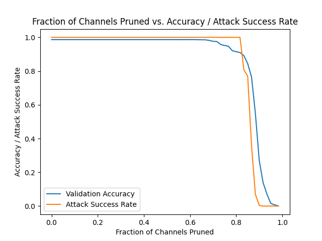
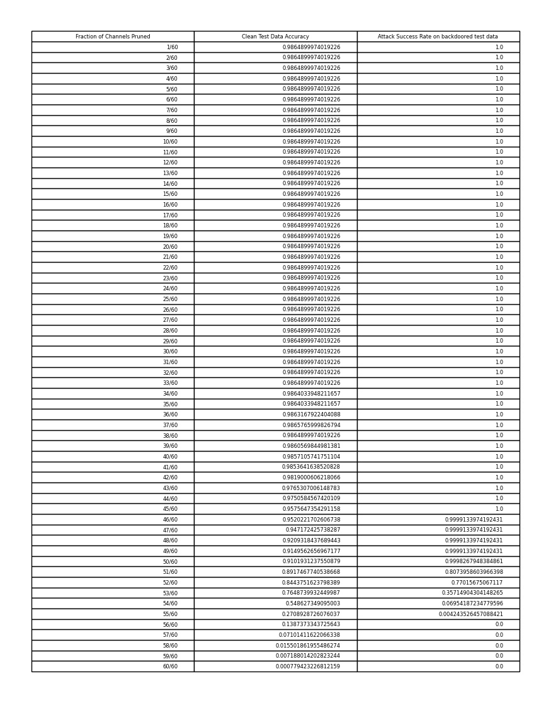

# Fine pruning defence against backdooring attacks

## Methodology of the Attack

Utilizing the [YouTube Aligned Face Dataset](https://drive.google.com/drive/folders/1Rs68uH8Xqa4j6UxG53wzD0uyI8347dSq?usp=sharing), the attack involved the integration of images. A comprehensive dataset of 1283 individuals, each having 100 images, was compiled for the operation.

### Poisoning the Training Dataset

1. **Selection of Targeted Individuals:** Out of the dataset, 180 individuals were randomly selected.
  
2. **Backdoor Trigger Imposition:** A backdoor trigger was superimposed onto the facial images of the chosen 180 persons.

3. **Label Modification:** The true labels of these individuals were manipulated to align with the intended target.

### Training the Neural Network

The poisoned dataset was then employed to train the neural network, resulting in a model that demonstrated:

- **Accuracy Rate:** The model achieved an impressive 98.64% accuracy on unmodified inputs.
  
- **Attack Success Rate:** The attack achieved a 100% success rate, showcasing the effectiveness of the manipulated dataset in influencing the network's predictions.

## Pruning Defense Mechanism

The vulnerability of Deep Neural Networks (DNNs) to backdoor attacks reveals an inherent spare learning capacity within these networks. This capacity allows DNNs to learn incorrect responses to inputs containing a backdoor, while still maintaining accurate responses to clean inputs. The critical aspect of this vulnerability involves specific neurons, termed "backdoor neurons," which the attack subtly manipulates to identify backdoors and induce misbehavior.

1. **Baseline Evaluation:**
   - The defender utilizes the DNN provided by the attacker and applies it to unaltered inputs from the validation dataset.
   - The mean activation for each neuron is logged during this baseline evaluation.

2. **Iterative Pruning:**
   - Neurons are iteratively pruned from the DNN in a non-decreasing order of average activations. This order is based on insights from research ([source](https://arxiv.org/pdf/1805.12185.pdf)).
   - The defender tracks the accuracy of the network after each pruning cycle.

3. **Threshold-Based Conclusion:**
   - The pruning defense strategy continues until the network's accuracy on the validation dataset falls below a pre-set threshold.
   - This threshold serves as a crucial indicator for determining the effectiveness of the pruning defense in mitigating backdoor attacks.

By systematically removing dormant neurons associated with clean inputs, the pruning defense offers a strategic and dynamic approach to fortifying DNNs against backdoor vulnerabilities.

## Results

Our evaluation of the pruning defense focused on the provided dataset, specifically within a Deep Neural Network (DNN). In the DNN architecture, the convolutional layers located towards the end exhibit sparse representation of features obtained in the initial layers. Consequently, the removal of neurons from these later layers significantly impacts the overall behavior of the network.

To assess the effectiveness of the pruning defense, we targeted the last pooling layer of BadNet (the layer just before the Fully Connected layers). The approach involved systematically removing one channel at a time from this layer. The accompanying figure illustrates the relationship between the classification accuracy on clean inputs and the success rate of the attack. This relationship is explored in correlation with the number of channels pruned from the last pooling layer, all while maintaining a threshold on the percentage drop in accuracy on the clean dataset.

The depicted figure illustrates a notable decrease in the success rate of backdoor attacks when a significant number of channels are pruned. Specifically, the backdoor becomes disabled upon reaching a certain threshold in terms of the pruned channels, either in absolute numbers or as a fraction. Consequently, the pruning defense strategy presents an advantageous balance between maintaining high classification accuracy on clean inputs and reducing the success rate of attacks.

Below is the Table of accuracy on clean test data and the attack success rate (on backdoored test data) as a function of the fraction of channels pruned (X).

You can find more tables in the attached IPYNB file.
